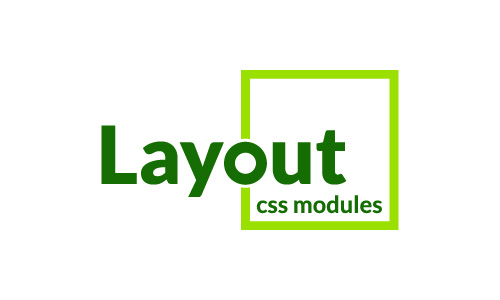

<p align="center">
    
</p>

<h1 align="center">Layout CSS Modules</h1>

<p align="center">Layout made easy with CSS modules grid system inspired by Bootstrap.</p>

<p align="center" style="align: center;">
    <a href="https://github.com/appzic/layout-css-modules/blob/main/LICENSE">
        
    </a>
</p>

Layout CSS Modules is a mobile-first, twelve column system based on a flexbox layout, that takes advantage of CSS modules for simpler styling and maintenance, allowing you to easily create responsive layouts for your web applications inspired by Bootstrap.

## Features

- Mobile-first design approach
- Based on a flexbox layout
- Twelve-column grid system
- Uses CSS modules for simpler styling and maintenance
- TypeScript support for type checking and improved development experience
- Encapsulation of CSS rules and styles to prevent conflicts
- Reusable styles across components for consistent designs
- Reduced duplicate code in your application
- Improved performance through unique class names generated at build time.

## Installation

You can install Layout CSS Modules using npm:

```bash
npm install layout-css-modules
```

## Usage

```astro
---
import { container, row, col12, colXL4 } from "layout-css-modules/index.module.css";
---

<div class:list={[container]}>
	<div class:list={[row]}>
		<div class:list={[col12, colXL4]}>Column</div>
		<div class:list={[col12, colXL4]}>Column</div>
		<div class:list={[col12, colXL4]}>Column</div>
	</div>
</div>

```

## Contributing

We welcome contributions from the community! Please take a look at our [CONTRIBUTING.md](CONTRIBUTING.md) file for more information on how to get started. We appreciate all kinds of contributions, from bug reports and feature requests to code contributions and documentation improvements. Thank you for considering contributing to our project!

## License

Layout CSS Modules is licensed under the [MIT](./LICENSE) License.
